# ER Diagram

## 1. Overview

This document defines the Entity-Relationship (ER) design for the Campus Management System.

The ER design is based on:

```text
database-overview.md
entities.md
relationships.md
```

The purpose of this document is to provide a visual and structural representation of the database before creating the physical MySQL schema.

---

# 2. Complete ER Diagram

The following Mermaid diagram represents the current planned database structure.

```mermaid
erDiagram

    USERS {
        BIGINT id PK
        VARCHAR email UK
        VARCHAR password_hash
        ENUM role
        ENUM status
        DATETIME created_at
        DATETIME updated_at
    }

    STUDENTS {
        BIGINT id PK
        BIGINT user_id FK
        VARCHAR register_number UK
        BIGINT class_id FK
        INT admission_year
        ENUM status
        DATETIME created_at
        DATETIME updated_at
    }

    FACULTIES {
        BIGINT id PK
        BIGINT user_id FK
        VARCHAR employee_id UK
        BIGINT department_id FK
        ENUM status
        DATETIME created_at
        DATETIME updated_at
    }

    DEPARTMENTS {
        BIGINT id PK
        VARCHAR department_code UK
        VARCHAR department_name
        ENUM status
        DATETIME created_at
        DATETIME updated_at
    }

    ACADEMIC_YEARS {
        BIGINT id PK
        VARCHAR year_name UK
        DATE start_date
        DATE end_date
        ENUM status
        DATETIME created_at
        DATETIME updated_at
    }

    SEMESTERS {
        BIGINT id PK
        INT semester_number
        VARCHAR semester_name
        BIGINT academic_year_id FK
        ENUM status
        DATETIME created_at
        DATETIME updated_at
    }

    CLASSES {
        BIGINT id PK
        VARCHAR class_name
        BIGINT department_id FK
        BIGINT semester_id FK
        BIGINT academic_year_id FK
        VARCHAR section
        ENUM status
        DATETIME created_at
        DATETIME updated_at
    }

    SUBJECTS {
        BIGINT id PK
        VARCHAR subject_code UK
        VARCHAR subject_name
        BIGINT department_id FK
        BIGINT semester_id FK
        DECIMAL credits
        VARCHAR subject_type
        ENUM status
        DATETIME created_at
        DATETIME updated_at
    }

    FACULTY_SUBJECTS {
        BIGINT id PK
        BIGINT faculty_id FK
        BIGINT subject_id FK
        BIGINT academic_year_id FK
        BIGINT semester_id FK
        ENUM status
    }

    CLASS_SUBJECTS {
        BIGINT id PK
        BIGINT class_id FK
        BIGINT subject_id FK
        BIGINT academic_year_id FK
        BIGINT semester_id FK
        ENUM status
    }

    PERIODS {
        BIGINT id PK
        INT period_number
        TIME start_time
        TIME end_time
        ENUM status
    }

    ROOMS {
        BIGINT id PK
        VARCHAR room_number
        VARCHAR building
        VARCHAR room_type
        INT capacity
        ENUM status
    }

    TIMETABLES {
        BIGINT id PK
        BIGINT class_id FK
        BIGINT subject_id FK
        BIGINT faculty_id FK
        BIGINT period_id FK
        BIGINT room_id FK
        BIGINT academic_year_id FK
        BIGINT semester_id FK
        ENUM day_of_week
        ENUM status
        DATETIME created_at
        DATETIME updated_at
    }

    TEMPORARY_TIMETABLES {
        BIGINT id PK
        BIGINT request_id FK
        BIGINT original_timetable_id FK
        BIGINT class_id FK
        BIGINT subject_id FK
        BIGINT faculty_id FK
        BIGINT period_id FK
        BIGINT room_id FK
        DATE date
        ENUM change_type
        BIGINT original_subject_id FK
        BIGINT original_faculty_id FK
        ENUM status
        DATETIME created_at
        DATETIME updated_at
    }

    ASSIGNMENTS {
        BIGINT id PK
        VARCHAR title
        TEXT description
        BIGINT class_id FK
        BIGINT subject_id FK
        BIGINT faculty_id FK
        DATETIME deadline
        ENUM status
        DATETIME created_at
        DATETIME updated_at
    }

    ASSIGNMENT_ATTACHMENTS {
        BIGINT id PK
        BIGINT assignment_id FK
        VARCHAR file_name
        VARCHAR file_type
        BIGINT file_size
        VARCHAR storage_reference
        DATETIME uploaded_at
    }

    EXAMS {
        BIGINT id PK
        VARCHAR exam_name
        VARCHAR exam_type
        BIGINT academic_year_id FK
        BIGINT semester_id FK
        ENUM status
        DATETIME created_at
        DATETIME updated_at
    }

    EXAM_TIMETABLES {
        BIGINT id PK
        BIGINT exam_id FK
        BIGINT class_id FK
        BIGINT subject_id FK
        BIGINT room_id FK
        DATE exam_date
        TIME start_time
        TIME end_time
        ENUM status
        DATETIME created_at
        DATETIME updated_at
    }

    PERIOD_REQUESTS {
        BIGINT id PK
        ENUM request_type
        BIGINT requester_faculty_id FK
        BIGINT receiver_faculty_id FK
        BIGINT original_timetable_id FK
        BIGINT class_id FK
        BIGINT period_id FK
        BIGINT original_subject_id FK
        BIGINT requested_subject_id FK
        DATE date
        TEXT request_note
        TEXT reply_note
        ENUM status
        DATETIME created_at
        DATETIME responded_at
    }

    NOTIFICATIONS {
        BIGINT id PK
        BIGINT user_id FK
        VARCHAR event_type
        ENUM channel
        VARCHAR title
        TEXT message
        ENUM status
        ENUM read_status
        DATETIME created_at
        DATETIME sent_at
        DATETIME delivered_at
        DATETIME read_at
        INT retry_count
        VARCHAR provider_message_id
        VARCHAR error_code
    }

    NOTIFICATION_PREFERENCES {
        BIGINT id PK
        BIGINT user_id FK
        BOOLEAN in_app_enabled
        BOOLEAN email_enabled
        BOOLEAN whatsapp_enabled
        DATETIME updated_at
    }

    ANNOUNCEMENTS {
        BIGINT id PK
        BIGINT created_by FK
        VARCHAR title
        TEXT content
        VARCHAR target_type
        BIGINT target_reference
        ENUM status
        DATETIME published_at
        DATETIME created_at
        DATETIME updated_at
    }

    USERS ||--o| STUDENTS : "has profile"
    USERS ||--o| FACULTIES : "has profile"

    DEPARTMENTS ||--o{ FACULTIES : contains
    DEPARTMENTS ||--o{ CLASSES : contains
    DEPARTMENTS ||--o{ SUBJECTS : manages

    ACADEMIC_YEARS ||--o{ SEMESTERS : contains
    ACADEMIC_YEARS ||--o{ CLASSES : includes
    ACADEMIC_YEARS ||--o{ FACULTY_SUBJECTS : defines
    ACADEMIC_YEARS ||--o{ CLASS_SUBJECTS : defines
    ACADEMIC_YEARS ||--o{ TIMETABLES : contains
    ACADEMIC_YEARS ||--o{ EXAMS : contains

    SEMESTERS ||--o{ CLASSES : contains
    SEMESTERS ||--o{ SUBJECTS : contains
    SEMESTERS ||--o{ FACULTY_SUBJECTS : defines
    SEMESTERS ||--o{ CLASS_SUBJECTS : defines
    SEMESTERS ||--o{ TIMETABLES : contains
    SEMESTERS ||--o{ EXAMS : contains

    CLASSES ||--o{ STUDENTS : has
    CLASSES ||--o{ CLASS_SUBJECTS : offers
    SUBJECTS ||--o{ CLASS_SUBJECTS : belongs_to

    FACULTIES ||--o{ FACULTY_SUBJECTS : teaches
    SUBJECTS ||--o{ FACULTY_SUBJECTS : assigned_to

    CLASSES ||--o{ TIMETABLES : scheduled_for
    FACULTIES ||--o{ TIMETABLES : teaches
    SUBJECTS ||--o{ TIMETABLES : scheduled_subject
    PERIODS ||--o{ TIMETABLES : uses
    ROOMS ||--o{ TIMETABLES : assigned_to

    TIMETABLES ||--o{ PERIOD_REQUESTS : requested_for
    FACULTIES ||--o{ PERIOD_REQUESTS : requests
    FACULTIES ||--o{ PERIOD_REQUESTS : receives
    CLASSES ||--o{ PERIOD_REQUESTS : belongs_to
    PERIODS ||--o{ PERIOD_REQUESTS : targets
    SUBJECTS ||--o{ PERIOD_REQUESTS : original_subject
    SUBJECTS ||--o{ PERIOD_REQUESTS : requested_subject

    PERIOD_REQUESTS ||--o| TEMPORARY_TIMETABLES : creates
    TIMETABLES ||--o{ TEMPORARY_TIMETABLES : overrides
    CLASSES ||--o{ TEMPORARY_TIMETABLES : affects
    FACULTIES ||--o{ TEMPORARY_TIMETABLES : teaches
    SUBJECTS ||--o{ TEMPORARY_TIMETABLES : teaches_subject
    PERIODS ||--o{ TEMPORARY_TIMETABLES : uses
    ROOMS ||--o{ TEMPORARY_TIMETABLES : assigned_to
    SUBJECTS ||--o{ TEMPORARY_TIMETABLES : original_subject
    FACULTIES ||--o{ TEMPORARY_TIMETABLES : original_faculty

    CLASSES ||--o{ ASSIGNMENTS : receives
    SUBJECTS ||--o{ ASSIGNMENTS : has
    FACULTIES ||--o{ ASSIGNMENTS : creates
    ASSIGNMENTS ||--o{ ASSIGNMENT_ATTACHMENTS : contains

    EXAMS ||--o{ EXAM_TIMETABLES : schedules
    CLASSES ||--o{ EXAM_TIMETABLES : has
    SUBJECTS ||--o{ EXAM_TIMETABLES : examines
    ROOMS ||--o{ EXAM_TIMETABLES : hosts

    USERS ||--o{ NOTIFICATIONS : receives
    USERS ||--|| NOTIFICATION_PREFERENCES : configures
    USERS ||--o{ ANNOUNCEMENTS : creates
```



---

# 3. Identity ER Structure

```text
             ┌─────────────┐
             │    USERS    │
             ├─────────────┤
             │ id PK       │
             │ email       │
             │ password    │
             │ role        │
             │ status      │
             └──────┬──────┘
                    │
          ┌─────────┴─────────┐
          │                   │
       0..1                0..1
          │                   │
          ↓                   ↓
   ┌─────────────┐     ┌─────────────┐
   │  STUDENTS   │     │  FACULTIES  │
   ├─────────────┤     ├─────────────┤
   │ id PK       │     │ id PK       │
   │ user_id FK  │     │ user_id FK  │
   │ class_id FK │     │ dept_id FK  │
   └─────────────┘     └─────────────┘
```

Admin accounts are initially represented using:

```text
users.role = ADMIN
```

No separate `admins` table is required for the MVP.

---

# 4. Academic Structure ER

```text
                    ┌──────────────────┐
                    │   DEPARTMENTS    │
                    └───────┬──────────┘
                            │
              ┌─────────────┼─────────────┐
              │             │             │
              ↓             ↓             ↓
         FACULTIES       CLASSES       SUBJECTS
              │             │             │
              │             │             │
              │        ┌────┴────┐        │
              │        ↓         ↓        │
              │     STUDENTS  CLASS_      │
              │               SUBJECTS    │
              │                    │       │
              └──────┐             └───────┘
                     │
               FACULTY_SUBJECTS
```

Academic context:

```text
ACADEMIC_YEAR
      │
      ↓
   SEMESTER
      │
      ↓
    CLASS
```

---

# 5. Class ↔ Subject Many-to-Many

The direct relationship is:

```text
CLASS N ───── N SUBJECT
```

The database resolves it using:

```text
CLASS_SUBJECTS
```

Diagram:

```text
┌─────────────┐        ┌──────────────────┐        ┌─────────────┐
│   CLASSES   │ 1    N │  CLASS_SUBJECTS  │ N    1 │  SUBJECTS   │
├─────────────┤────────├──────────────────┤────────├─────────────┤
│ id PK       │        │ id PK            │        │ id PK       │
│ class_name  │        │ class_id FK      │        │ subject_id  │
│ ...         │        │ subject_id FK    │        │ subject...  │
└─────────────┘        │ academic_year_id │        └─────────────┘
                       │ semester_id      │
                       └──────────────────┘
```

This table tells the system which subjects belong to which class for a specific academic context.

---

# 6. Faculty ↔ Subject Many-to-Many

The direct relationship is:

```text
FACULTY N ───── N SUBJECT
```

Resolved using:

```text
FACULTY_SUBJECTS
```

Diagram:

```text
┌─────────────┐       ┌───────────────────┐       ┌─────────────┐
│  FACULTIES  │ 1   N │ FACULTY_SUBJECTS  │ N   1 │  SUBJECTS   │
├─────────────┤───────├───────────────────┤───────├─────────────┤
│ id PK       │       │ id PK             │       │ id PK       │
│ user_id FK  │       │ faculty_id FK     │       │ subject_id  │
│ department  │       │ subject_id FK     │       │ subject...  │
└─────────────┘       │ academic_year_id  │       └─────────────┘
                      │ semester_id       │
                      └───────────────────┘
```

This is important for borrow-period validation.

---

# 7. Timetable ER Structure

```text
                    ┌──────────────┐
                    │   CLASSES    │
                    └──────┬───────┘
                           │
                           │
                    ┌──────▼───────┐
                    │  TIMETABLES  │
                    └──────┬───────┘
                           │
          ┌────────────────┼────────────────┐
          │                │                │
          ↓                ↓                ↓
      SUBJECTS          FACULTIES         PERIODS
          │                                 │
          │                                 │
          └────────────────┬────────────────┘
                           │
                           ↓
                         ROOMS
```

A timetable entry therefore connects:

```text
Class
Subject
Faculty
Period
Room
Academic Year
Semester
Day
```

---

# 8. Timetable Record Concept

Example:

```text
TIMETABLES

id                  = 101
class_id            = S2 CSE
subject_id          = OOP
faculty_id          = Faculty B
period_id           = Period 3
room_id             = Room 201
academic_year_id    = 2026-2027
semester_id         = S3
day_of_week         = MONDAY
```

This represents the normal/master timetable.

---

# 9. Temporary Timetable ER

```text
                    ┌────────────────────┐
                    │  PERIOD_REQUESTS   │
                    └─────────┬──────────┘
                              │
                              │ 1 : 0..1
                              ↓
                 ┌──────────────────────────┐
                 │ TEMPORARY_TIMETABLES     │
                 └────────────┬─────────────┘
                              │
             ┌────────────────┼─────────────────┐
             │                │                 │
             ↓                ↓                 ↓
        ORIGINAL         TEMPORARY          TEMPORARY
       TIMETABLE          FACULTY            SUBJECT
             │                │                 │
             └────────────────┼─────────────────┘
                              ↓
                           CLASS
```

The temporary record also references:

```text
Period
Room
Date
Change Type
Original Faculty
Original Subject
```

---

# 10. Master + Temporary Timetable

The logical timetable shown to users is:

```text
             MASTER TIMETABLE
                    │
                    +
                    │
          TEMPORARY TIMETABLE
                    │
                    ↓
           EFFECTIVE TIMETABLE
```

The database should never need to overwrite the master record for a temporary change.

---

# 11. Substitute ER Example

```text
FACULTY A
   │
   │ requester
   ↓
PERIOD_REQUEST
   │
   │ receiver
   ↓
FACULTY B

PERIOD_REQUEST
   │
   ├── original_timetable → TIMETABLE
   ├── original_subject → SUBJECT
   ├── requested_subject → SAME SUBJECT
   └── request_type → SUBSTITUTE
             │
             ↓
      TEMPORARY_TIMETABLE
             │
             ├── faculty → FACULTY B
             └── subject → ORIGINAL SUBJECT
```

Result:

```text
Same Subject
Different Faculty
```

---

# 12. Borrow ER Example

```text
FACULTY B
   │
   │ requester
   ↓
PERIOD_REQUEST
   │
   │ receiver
   ↓
FACULTY A

PERIOD_REQUEST
   │
   ├── original_timetable → TIMETABLE
   ├── original_subject → Data Structures
   ├── requested_subject → OOP
   └── request_type → BORROW
             │
             ↓
      TEMPORARY_TIMETABLE
             │
             ├── faculty → FACULTY B
             └── subject → OOP
```

Result:

```text
Different Subject
Different Faculty
```

---

# 13. Assignment ER Structure

```text
                ┌──────────────┐
                │   FACULTY    │
                └──────┬───────┘
                       │
                       │ creates
                       ↓
                ┌──────────────┐
                │ ASSIGNMENTS  │
                └──────┬───────┘
                       │
              ┌────────┼────────┐
              ↓        ↓        ↓
           CLASS     SUBJECT   ATTACHMENT
                         │        │
                         │        │
                         └────────┘
```

Actual relationship:

```text
Faculty 1 ─── N Assignment
Class   1 ─── N Assignment
Subject 1 ─── N Assignment
Assignment 1 ─── N Attachment
```

---

# 14. Assignment Attachment ER

```text
┌──────────────┐
│ ASSIGNMENTS  │
├──────────────┤
│ id PK        │
└──────┬───────┘
       │
       │ 1 : N
       ↓
┌────────────────────────┐
│ ASSIGNMENT_ATTACHMENTS │
├────────────────────────┤
│ id PK                  │
│ assignment_id FK      │
│ file_name              │
│ file_type              │
│ storage_reference      │
└────────────────────────┘
```

One assignment can have zero or multiple attachments.

---

# 15. Examination ER

```text
             ┌────────────┐
             │    EXAMS   │
             └─────┬──────┘
                   │
                   │ 1 : N
                   ↓
          ┌──────────────────┐
          │ EXAM_TIMETABLES  │
          └────────┬─────────┘
                   │
             ┌─────┼─────┐
             ↓     ↓     ↓
          CLASS SUBJECT ROOM
```

This supports:

```text
Exam
Class
Subject
Date
Start Time
End Time
Room
```

---

# 16. Period Request ER

```text
                         FACULTY
                        /       \
                       /         \
              requester           receiver
                   │                 │
                   └───────┬─────────┘
                           ↓
                  ┌─────────────────┐
                  │ PERIOD_REQUESTS  │
                  └────────┬────────┘
                           │
             ┌─────────────┼─────────────┐
             ↓             ↓             ↓
         TIMETABLE       CLASS        SUBJECTS
                           │
                           ↓
                     TEMPORARY_
                     TIMETABLE
```

---

# 17. Notification ER

```text
                    ┌──────────────┐
                    │    USERS     │
                    └──────┬───────┘
                           │
                 ┌─────────┴─────────┐
                 │                   │
                 ↓                   ↓
        ┌─────────────────┐  ┌────────────────────────┐
        │ NOTIFICATIONS   │  │ NOTIFICATION_          │
        │                 │  │ PREFERENCES            │
        └─────────────────┘  └────────────────────────┘
```

A user receives many notifications but has one primary notification-preference record.

---

# 18. Notification Channels

The notification entity supports:

```text
                    NOTIFICATION
                          │
          ┌───────────────┼───────────────┐
          ↓               ↓               ↓
       IN_APP           EMAIL          WHATSAPP
          │               │               │
          ↓               ↓               ↓
       DATABASE        PROVIDER       WHATSAPP API
```

The database stores the notification record and delivery state.

External API credentials are not stored in notification records.

---

# 19. Announcement ER

```text
               ┌──────────────┐
               │     USERS    │
               │   ADMIN      │
               └──────┬───────┘
                      │
                      │ creates
                      ↓
              ┌────────────────┐
              │ ANNOUNCEMENTS  │
              └────────────────┘
```

Publishing an announcement can trigger:

```text
Announcement
      ↓
NotificationService
      ↓
Notifications
```

There is no requirement for a direct `announcement_id` foreign key in the notification table in the initial generic event-reference design.

---

# 20. Complete Academic ER Flow

```text
                         DEPARTMENT
                        /    |     \
                       /     |      \
                      ↓      ↓       ↓
                 FACULTY   CLASS   SUBJECT
                    │        │        │
                    │        │        │
                    │        └──┬─────┘
                    │           │
                    │     CLASS_SUBJECTS
                    │
              FACULTY_SUBJECTS
                    │
                    └────────┬────────┐
                             │        │
                             ↓        ↓
                         TIMETABLE   ASSIGNMENT
                             │          │
                    ┌────────┼───┐     │
                    ↓        ↓   ↓     ↓
                 PERIOD    ROOM  TEMP  ATTACHMENT
                                  │
                                  ↓
                         TEMPORARY_TIMETABLE
                                  ↑
                                  │
                           PERIOD_REQUEST
```

---

# 21. Complete Database ER Overview

```text
                                  USERS
                                    │
                    ┌───────────────┼───────────────┐
                    ↓               ↓               ↓
                 STUDENTS        FACULTIES        ADMIN
                    │               │
                    │               ↓
                    │          DEPARTMENTS
                    │          /     |      \
                    │         ↓      ↓       ↓
                    │     FACULTY  CLASS   SUBJECT
                    │                │        │
                    │                ├────────┤
                    │                ↓        ↓
                    │          CLASS_SUBJECTS
                    │
                    └──────────→ CLASS
                                  │
                                  ↓
                              TIMETABLE
                              /   |   \
                             /    |    \
                            ↓     ↓     ↓
                        SUBJECT FACULTY PERIOD
                                  │
                                  ↓
                                ROOM

TIMETABLE
    │
    ↓
PERIOD_REQUEST
    │
    ↓
TEMPORARY_TIMETABLE
    │
    ├── CLASS
    ├── SUBJECT
    ├── FACULTY
    ├── PERIOD
    └── ROOM


FACULTY
   │
   ↓
ASSIGNMENT
   │
   ↓
ATTACHMENT


EXAM
   │
   ↓
EXAM_TIMETABLE
   ├── CLASS
   ├── SUBJECT
   └── ROOM


USERS
   │
   ├── NOTIFICATIONS
   │       ├── IN_APP
   │       ├── EMAIL
   │       └── WHATSAPP
   │
   └── NOTIFICATION_PREFERENCES


ADMIN
   │
   ↓
ANNOUNCEMENT
   │
   ↓
NOTIFICATION
```

---

# 22. Entity-to-Entity Relationship Matrix

| Entity A | Relationship | Entity B | Implementation |
|---|---|---|---|
| User | 1 : 0..1 | Student | `students.user_id` |
| User | 1 : 0..1 | Faculty | `faculties.user_id` |
| Department | 1 : N | Faculty | `faculties.department_id` |
| Department | 1 : N | Class | `classes.department_id` |
| Department | 1 : N | Subject | `subjects.department_id` |
| AcademicYear | 1 : N | Semester | `semesters.academic_year_id` |
| AcademicYear | 1 : N | Class | `classes.academic_year_id` |
| Semester | 1 : N | Class | `classes.semester_id` |
| Class | 1 : N | Student | `students.class_id` |
| Class | N : N | Subject | `class_subjects` |
| Faculty | N : N | Subject | `faculty_subjects` |
| Period | 1 : N | Timetable | `timetables.period_id` |
| Room | 1 : N | Timetable | `timetables.room_id` |
| Class | 1 : N | Timetable | `timetables.class_id` |
| Faculty | 1 : N | Timetable | `timetables.faculty_id` |
| Subject | 1 : N | Timetable | `timetables.subject_id` |
| Timetable | 1 : N | PeriodRequest | `period_requests.original_timetable_id` |
| Faculty | 1 : N | PeriodRequest | requester FK |
| Faculty | 1 : N | PeriodRequest | receiver FK |
| PeriodRequest | 1 : 0..1 | TemporaryTimetable | `temporary_timetables.request_id` |
| Timetable | 1 : N | TemporaryTimetable | `temporary_timetables.original_timetable_id` |
| Class | 1 : N | Assignment | `assignments.class_id` |
| Subject | 1 : N | Assignment | `assignments.subject_id` |
| Faculty | 1 : N | Assignment | `assignments.faculty_id` |
| Assignment | 1 : N | Attachment | `assignment_attachments.assignment_id` |
| Exam | 1 : N | ExamTimetable | `exam_timetables.exam_id` |
| Class | 1 : N | ExamTimetable | `exam_timetables.class_id` |
| Subject | 1 : N | ExamTimetable | `exam_timetables.subject_id` |
| Room | 1 : N | ExamTimetable | `exam_timetables.room_id` |
| User | 1 : N | Notification | `notifications.user_id` |
| User | 1 : 1 | NotificationPreference | `notification_preferences.user_id` |
| User | 1 : N | Announcement | `announcements.created_by` |

---

# 23. Important ER Design Decisions

## 23.1 No Student → Assignment Table

Do not create:

```text
student_assignments
```

for the current core system.

Use:

```text
Student
   ↓
Class
   ↓
Assignment
```

This means all students in the target class receive the assignment.

A submission system can introduce `student_assignments` later if needed.

---

## 23.2 No Student → Timetable Table

Students receive the timetable through their class:

```text
Student
   ↓
Class
   ↓
Timetable
```

This avoids duplicating timetable records for every student.

---

## 23.3 No Faculty → Student Direct Relationship

Faculty and students are connected through:

```text
Faculty
   ↓
Subject
   ↓
Timetable
   ↓
Class
   ↓
Student
```

A direct faculty-student table is unnecessary for the core system.

---

## 23.4 No Calendar Table Initially

Calendar data is derived from:

```text
Assignment
ExamTimetable
Timetable
TemporaryTimetable
PeriodRequest
Announcement
```

This reduces duplication.

---

## 23.5 Temporary Timetable Must Reference Request

```text
PeriodRequest
      ↓
TemporaryTimetable
```

This provides traceability for every approved temporary change.

---

## 23.6 Separate Original and Temporary Values

Temporary timetable records retain:

```text
original_subject_id
original_faculty_id
```

as well as:

```text
subject_id
faculty_id
```

This makes the change explicit.

Example:

```text
Original:
Data Structures
Faculty A

Temporary:
Data Structures
Faculty B
```

or:

```text
Original:
Data Structures
Faculty A

Temporary:
OOP
Faculty B
```

---

# 24. ER Design and Business Rules

The ER diagram defines structural relationships.

Business rules still need Service Layer validation.

Examples:

```text
Faculty can teach Subject?
        ↓
FacultySubject validation

Subject belongs to Class?
        ↓
ClassSubject validation

Faculty already teaching another class?
        ↓
Timetable conflict validation

Room already occupied?
        ↓
Room conflict validation

Borrow request uses faculty's own subject?
        ↓
FacultySubject validation
```

Therefore:

```text
Database Relationships
        +
Service Layer Business Rules
        ↓
Valid System
```

---

# 25. ER Diagram → Database Schema

The implementation sequence is:

```text
Entities
   ↓
Relationships
   ↓
ER Diagram
   ↓
Normalization Review
   ↓
Database Schema
   ↓
Table Structure
   ↓
Constraints
   ↓
Indexes
   ↓
SQL
```

Do not start writing the final SQL schema until the ER design has been reviewed.

---

# 26. Normalization Review

The current ER design aims to support:

```text
1NF
2NF
3NF
```

Important normalization decisions:

```text
Faculty ↔ Subject
        ↓
faculty_subjects

Class ↔ Subject
        ↓
class_subjects

Assignment ↔ Attachment
        ↓
assignment_attachments

User → Notification
        ↓
notifications

User → Notification Preference
        ↓
notification_preferences
```

---

# 27. Final ER Architecture

```text
                         ┌──────────────────────┐
                         │        USERS         │
                         └──────────┬───────────┘
                                    │
                 ┌──────────────────┼──────────────────┐
                 ↓                  ↓                  ↓
             STUDENTS           FACULTIES            ADMIN
                 │                  │
                 ↓                  ↓
              CLASSES          DEPARTMENTS
                 │                  │
                 ├────────────┐     ├──────────────┐
                 │            │     │              │
                 ↓            ↓     ↓              ↓
          CLASS_SUBJECTS   TIMETABLES          SUBJECTS
                 │            │                    │
                 └────────────┼────────────────────┘
                              │
                 ┌────────────┼────────────┐
                 ↓            ↓            ↓
              PERIOD         ROOM       FACULTY
                              │            │
                              └─────┬──────┘
                                    ↓
                              PERIOD_REQUEST
                                    │
                                    ↓
                          TEMPORARY_TIMETABLE
                                    │
                                    ↓
                           EFFECTIVE TIMETABLE


                    FACULTY ─────→ ASSIGNMENT
                                      │
                                      ↓
                               ATTACHMENTS


                     EXAM ─────→ EXAM_TIMETABLE
                                      │
                               ┌──────┼──────┐
                               ↓      ↓      ↓
                             CLASS SUBJECT ROOM


                         USERS
                           │
                ┌──────────┴──────────┐
                ↓                     ↓
          NOTIFICATIONS       NOTIFICATION_PREFERENCES
                │
        ┌───────┼────────┐
        ↓       ↓        ↓
      IN-APP   EMAIL   WHATSAPP


                         ADMIN
                           │
                           ↓
                     ANNOUNCEMENT
                           │
                           ↓
                     NOTIFICATION
```

---

# 28. Final ER Design Rules

1. `users` is the central authentication entity.
2. Student and faculty profiles reference users.
3. Admin role is initially represented by `users.role`.
4. Departments contain faculty, classes, and subjects.
5. Academic years provide academic context.
6. Semesters belong to academic years.
7. Classes belong to departments, semesters, and academic years.
8. Students belong to classes.
9. Faculty and subjects use a many-to-many mapping.
10. Classes and subjects use a many-to-many mapping.
11. Timetable entries connect class, subject, faculty, period, room, and academic context.
12. Master timetable records are never overwritten for temporary changes.
13. Temporary timetable records originate from approved period requests.
14. Substitute requests keep the original subject.
15. Borrow requests use the borrowing faculty's subject.
16. Assignments belong to classes, subjects, and faculty.
17. Assignment attachments belong to assignments.
18. Exams have examination timetable entries.
19. Notifications belong to users.
20. Notification preferences belong to users.
21. WhatsApp is implemented as a notification channel.
22. Announcements are created by authorized administrators.
23. Calendar data is derived from existing academic entities initially.
24. Mapping tables resolve many-to-many relationships.
25. Service-layer validation is required in addition to database constraints.
26. The physical schema must be reviewed against this ER design before implementation.

---
